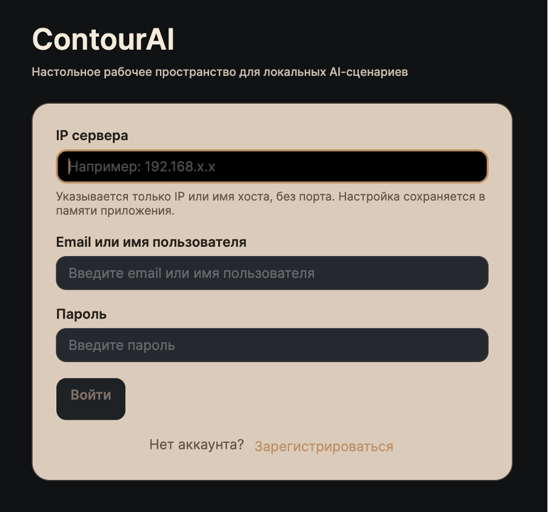
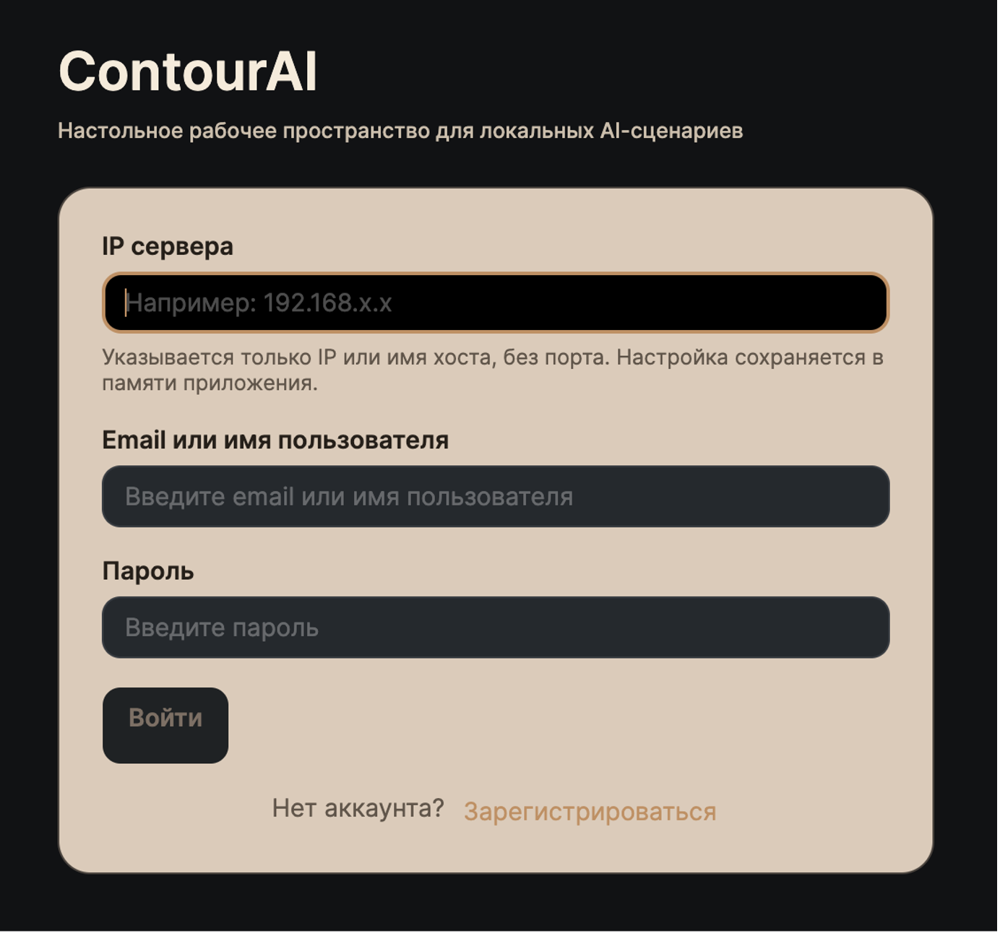
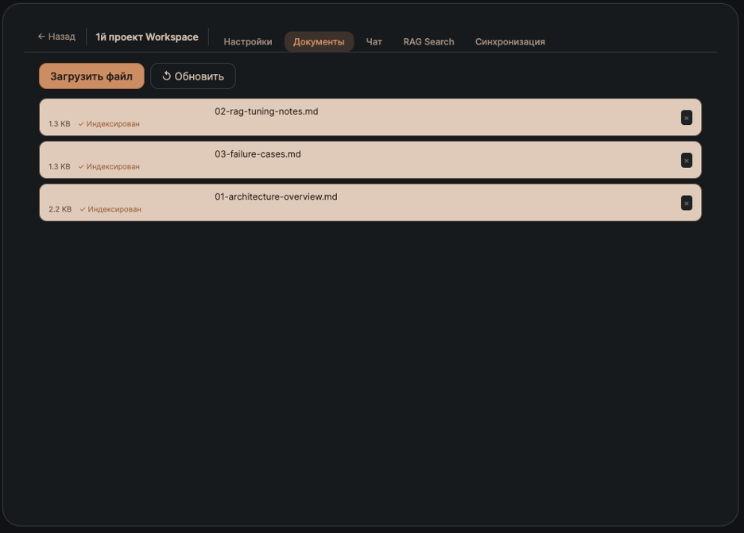
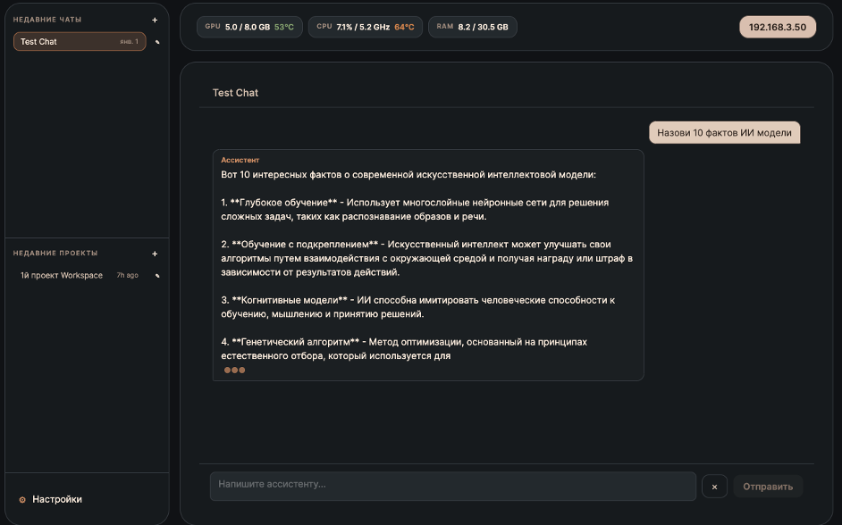
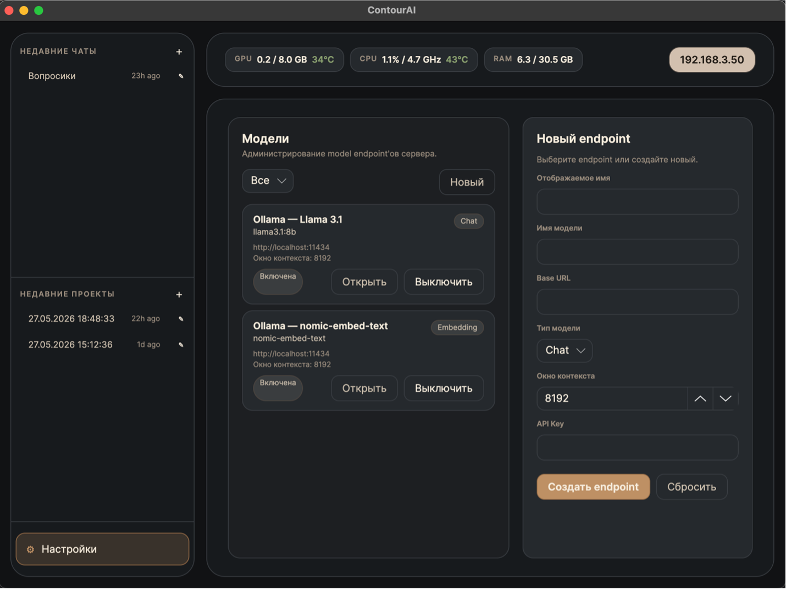

<div align="center">

# 🤖 Contour

**Desktop AI Chat Client · Built with Avalonia UI**

*A clean, cross-platform desktop interface for interacting with your AI backend.*

> ⚠️ **This is the UI client only.** A running backend server is required.
> See → [ContourAI Server](https://github.com/makksesh/LocalServerAI.git) *(backend repository)*

</div>

***

## Overview

**Contour** is a cross-platform desktop application built with [Avalonia UI](https://avaloniaui.net/) that provides a native chat interface for the ContourAI backend. It connects to a locally deployed AI server and lets you chat, manage context, and interact with your documents — all from a responsive native window on Windows, macOS, or Linux.

The UI is built using the **MVVM pattern** with a feature-based folder structure, keeping views, view models, and business logic cleanly separated.

***

## ✨ Features

- **Chat Interface** — Clean, native chat UI with message history
- **Backend Integration** — Connects to ContourAI server via REST API
- **Cross-Platform** — Runs natively on Windows, macOS, and Linux

***

## 📸 Screenshots


<p align="center">
  
</p>
<p align="center">
  
</p>
<p align="center">
  
</p>
<p align="center">
  
</p>
<p align="center">
  
</p>

***

## 🛠️ Tech Stack

| Technology       | Role |
|------------------|---|
| **C# / .NET 10** | Application language & runtime |
| **Avalonia UI**  | Cross-platform desktop UI framework |

***

## 🚀 Getting Started

### Prerequisites

- [.NET 10 SDK](https://dotnet.microsoft.com/download)
- A running instance of the [ContourAI backend](https://github.com/makksesh/ContourAI)

### Run from Source

```bash
# Clone the repository
git clone https://github.com/makksesh/Contour.git
cd Contour

# Restore dependencies
dotnet restore

# Run the application
dotnet run --project ContourAI/ContourAI.csproj
```

### Configure Backend URL

Before launching, make sure the backend URL is set to point to your running ContourAI server. You can configure this in the app settings or directly in the configuration file.

***

## 📁 Project Structure

```
Contour/
├── ContourAI/
│   ├── Features/           # Feature-based view + viewmodel modules
│   ├── Widgets/            # Reusable UI components
│   ├── Entities/           # Domain models / DTOs
│   ├── Shared/             # Shared helpers and base classes
│   ├── Assets/             # Icons, images, fonts
│   ├── App.axaml           # Application entry point & global styles
│   ├── MainWindow.axaml    # Main window layout
│   └── Program.cs          # Host builder & DI setup
└── ContourAI.sln
```

***

## 📄 License

Distributed under the MIT License. See [`LICENSE`](LICENSE) for more information.

***

<div align="center">

Built by [makksesh](https://github.com/makksesh) · Powered by open-source AI
