## Пользовательские use cases

| ID | Use case | Экран UI | Основной сценарий | API |
| :-- | :-- | :-- | :-- | :-- |
| UC-01 | Регистрация нового пользователя | Sign Up | Пользователь вводит `username`, `email`, `password`, получает пару `access/refresh` токенов и попадает в приложение.  | `POST /api/auth/register`  |
| UC-02 | Вход по email или username | Login | Пользователь вводит `identifier` и `password`, а UI сохраняет токены и подгружает профиль через `me`.  | `POST /api/auth/login`, `GET /api/auth/me`  |
| UC-03 | Автообновление сессии | Global app shell | При `401` клиент тихо вызывает refresh, сохраняет новую пару токенов и повторяет исходный запрос без выброса пользователя из UI.  | `POST /api/auth/refresh`  |
| UC-04 | Выход из аккаунта | Profile / Settings | Пользователь нажимает logout, UI отзывает refresh-token и очищает локальную сессию.  | `POST /api/auth/logout`  |
| UC-05 | Просмотр главного экрана | Dashboard | После входа пользователь видит до 5 последних проектов, чатов и документов в одном агрегированном запросе.  | `GET /api/dashboard/recent`  |
| UC-06 | Просмотр списка проектов | Projects list | UI показывает полный список проектов пользователя без пагинации, поэтому нужен поиск/фильтр на клиенте.  | `GET /api/projects`  |
| UC-07 | Создание проекта | New Project modal | Пользователь задаёт `name`, `description`, `accessMode`, после чего видит карточку нового проекта.  | `POST /api/projects`  |
| UC-08 | Просмотр карточки проекта | Project details | Пользователь открывает проект и получает его метаданные, связанные папки, документы и чаты как отдельные вкладки интерфейса.  | `GET /api/projects/{projectId}` + связанные разделы через другие API  |
| UC-09 | Настройка AI-параметров проекта | Project Settings | Пользователь меняет `systemPrompt`, `maxTokens`, `temperature`, `ragTopK`, `useRagContext`, `contextWindowSize` и опционально выбирает model endpoint.  | `PATCH /api/projects/{projectId}/settings`  |
| UC-10 | Подключение рабочей папки | Project Files | Пользователь указывает `path` и права доступа папки для проекта.  | `POST /api/projects/{projectId}/folders`  |
| UC-11 | Изменение прав папки | Folder permissions | UI даёт чекбоксы `Read / Edit / Delete`, сериализуя их в строковый flags enum вроде `Read, Edit`.  | `PATCH /api/projects/{projectId}/folder/permission`  |
| UC-12 | Удаление или отвязка папки | Folder actions | Пользователь может отвязать директорию от проекта отдельным действием без удаления проекта.  | `DELETE /api/projects/{projectId}/folder`  |
| UC-13 | Создание project thread | Project Chat | Внутри проекта пользователь создаёт новый тред с названием и привязкой к `projectId`.  | `POST /api/chat/threads`  |
| UC-14 | Создание global thread | Global Chat | Пользователь создаёт отдельный глобальный чат, не связанный с проектом.  | `POST /api/chat/threads/global`  |
| UC-15 | Просмотр списка тредов | Chat sidebar | В проекте UI показывает `GET /projects/{projectId}/threads`, а для общих разговоров — список global threads.  | `GET /api/chat/projects/{projectId}/threads`, `GET /api/chat/threads`  |
| UC-16 | Просмотр истории сообщений | Chat view | При открытии треда интерфейс загружает историю сообщений и отображает роли `User` / `Assistant`.  | `GET /api/chat/threads/{threadId}/history`  |
| UC-17 | Отправка сообщения без стрима | Chat input | Пользователь отправляет вопрос и получает пару сообщений: своё и готовый ответ ассистента.  | `POST /api/chat/threads/{threadId}/send`  |
| UC-18 | Отправка сообщения со стримингом | Chat streaming | UI показывает токены ответа по мере поступления и завершает рендер, когда приходит `event: done`; парсер должен учитывать нестандартный SSE без `data:`.  | `POST /api/chat/threads/{threadId}/stream`  |
| UC-19 | Переименование треда | Thread actions | Пользователь меняет заголовок беседы из контекстного меню.  | `PUT /api/chat/threads/{threadId}`  |
| UC-20 | Привязка global thread к проекту | Thread management | Пользователь переносит полезный глобальный диалог в конкретный проект.  | `POST /api/chat/threads/{threadId}/attach`  |
| UC-21 | Отвязка треда от проекта | Thread management | Пользователь превращает project thread обратно в global thread.  | `DELETE /api/chat/threads/{threadId}/attach`  |
| UC-22 | Удаление треда | Thread actions | Пользователь удаляет ненужный чат без возврата тела ответа.  | `DELETE /api/chat/threads/{threadId}`  |
| UC-23 | Загрузка документа в проект | Documents tab | Пользователь загружает файл через multipart-форму с `file` и `projectId`; размер ограничен примерно 50 MB.  | `POST /api/documents/upload`  |
| UC-24 | Просмотр списка документов проекта | Documents tab | UI показывает все документы проекта со статусами `Uploaded`, `Pending`, `Processing`, `Indexed`, `Failed`.  | `GET /api/documents/projects/{projectId}`  |
| UC-25 | Просмотр документа | Document details | Пользователь открывает карточку документа и видит `sizeBytes`, `contentType`, `chunkCount`, `indexedAtUtc`, `errorMessage`.  | `GET /api/documents/{documentId}`  |
| UC-26 | Удаление документа | Document actions | Пользователь удаляет файл из проекта.  | `DELETE /api/documents/{documentId}`  |
| UC-27 | Запуск индексирования | Indexing action | После загрузки пользователь вручную ставит документ в очередь индексации.  | `POST /api/indexing/queue`  |
| UC-28 | Отслеживание статуса индексации | Indexing status | UI периодически проверяет статус задачи; `204` должен отображаться как “ещё не поставлено в очередь”, а не как ошибка.  | `GET /api/indexing/status/{documentId}`  |
| UC-29 | Просмотр очереди индексации | Queue screen | Пользователь видит список задач и их состояния `Queued`, `Running`, `Completed`, `Failed`.  | `GET /api/indexing/queue`  |
| UC-30 | Повторная постановка в очередь | Retry action | Если задача упала, пользователь нажимает requeue и получает новую попытку обработки.  | `POST /api/indexing/requeue`  |
| UC-31 | Семантический поиск по проекту | RAG Search | Пользователь вводит запрос, выбирает `TopK`, получает список чанков, отсортированных по `Score` по убыванию.  | `POST /api/rag/search`  |
| UC-32 | Просмотр системных метрик | System monitor | Пользователь видит текущие CPU, RAM и GPU показатели в отдельном виджете или статус-панели.  | `GET /api/system/metrics`  |

## Админские use cases

| ID | Use case | Экран UI | Основной сценарий | API                                      |
| :-- | :-- | :-- | :-- |:-----------------------------------------|
| AUC-01 | Просмотр списка endpoint-ов | Admin / Models | Админ видит все endpoints и может фильтровать по `Chat` или `Embedding`.  | `GET /api/models?modelType=...`    |
| AUC-02 | Просмотр карточки endpoint-а | Admin / Model details | Админ открывает конкретную модель и видит её конфигурацию без `ApiKey`, потому что ключ не возвращается сервером.  | `GET /api/models/{endpointId}`           |
| AUC-03 | Создание endpoint-а | Admin / Create model | Админ задаёт `displayName`, `modelName`, `baseUrl`, `modelType`, `contextWindowTokens`, опционально `apiKey`.  | `POST /api/models`                       |
| AUC-04 | Редактирование endpoint-а | Admin / Edit model | Админ обновляет конфигурацию endpoint-а и при необходимости заменяет `apiKey`.  | `PUT /api/models/{endpointId}`           |
| AUC-05 | Включение/отключение endpoint-а | Admin / Toggle | Админ быстро переключает `isEnabled` без полного редактирования объекта.  | `PATCH /api/models/{endpointId}/enabled` |
| AUC-06 | Удаление endpoint-а | Admin / Danger zone | Админ удаляет устаревшую модель из системы.  | `DELETE /api/models/{endpointId}`  |

## UX-сценарии и приоритет MVP

MVP: `Auth -> Dashboard -> Projects -> Chat -> Documents -> Indexing -> RAG`, а `System Metrics` и `Admin Models` выносил во вторую очередь, потому что основной пользовательский путь уже закрывается без них.
Отдельно стоит заложить технические use cases интерфейса: обработку `ProblemDetails` для ошибок `400/401/403/404/422/429/500`, щадящий polling из-за лимита `100 запросов / 10 сек`, и устойчивый SSE-парсер для нестандартного формата потока токенов.

## UML use cases

Ниже диаграмма вариантов использования.

```mermaid
flowchart LR
    Guest[Guest]
    User[User]
    Admin[Admin]

    subgraph Auth["Auth"]
        UC1[Register]
        UC2[Login]
        UC3[Refresh session]
        UC4[Logout]
        UC5[View profile]
    end

    subgraph Dashboard["Dashboard"]
        UC6[View recent projects chats documents]
    end

    subgraph Projects["Projects"]
        UC7[View projects]
        UC8[Create project]
        UC9[Open project]
        UC10[Update project settings]
        UC11[Attach folder]
        UC12[Change folder permissions]
        UC13[Detach folder]
        UC14[Delete project]
    end

    subgraph Chat["Chat"]
        UC15[Create project thread]
        UC16[Create global thread]
        UC17[View thread list]
        UC18[Open thread history]
        UC19[Send message]
        UC20[Stream assistant response]
        UC21[Rename thread]
        UC22[Attach thread to project]
        UC23[Detach thread from project]
        UC24[Delete thread]
    end

    subgraph Documents["Documents and Indexing"]
        UC25[Upload document]
        UC26[View project documents]
        UC27[Open document details]
        UC28[Delete document]
        UC29[Queue indexing]
        UC30[Track indexing status]
        UC31[View indexing queue]
        UC32[Requeue failed task]
    end

    subgraph Rag["RAG"]
        UC33[Semantic search in project]
    end

    subgraph System["System"]
        UC34[View system metrics]
    end

    subgraph Models["Admin models"]
        UC35[View model endpoints]
        UC36[Open model endpoint]
        UC37[Create model endpoint]
        UC38[Update model endpoint]
        UC39[Enable disable model endpoint]
        UC40[Delete model endpoint]
    end

    Guest --> UC1
    Guest --> UC2
    Guest --> UC3

    User --> UC4
    User --> UC5
    User --> UC6
    User --> UC7
    User --> UC8
    User --> UC9
    User --> UC10
    User --> UC11
    User --> UC12
    User --> UC13
    User --> UC14
    User --> UC15
    User --> UC16
    User --> UC17
    User --> UC18
    User --> UC19
    User --> UC20
    User --> UC21
    User --> UC22
    User --> UC23
    User --> UC24
    User --> UC25
    User --> UC26
    User --> UC27
    User --> UC28
    User --> UC29
    User --> UC30
    User --> UC31
    User --> UC32
    User --> UC33
    User --> UC34

    Admin --> UC35
    Admin --> UC36
    Admin --> UC37
    Admin --> UC38
    Admin --> UC39
    Admin --> UC40
```



Для текстового описания диаграммы в дипломе можно зафиксировать, что основной пользовательский поток строится вокруг проекта, внутри которого пользователь настраивает AI-параметры, ведёт чат, загружает документы и запускает индексацию для последующего RAG-поиска.
Отдельный административный поток существует из-за независимого набора endpoint-ов `/api/models`, где управляются chat- и embedding-модели на уровне системы.

## Экранная структура

Ниже экранная карта, которую удобно использовать как sitemap desktop-приложения.

```text
DevAssistant
├── Auth
│   ├── Login
│   ├── Register
│   └── Session restore / refresh
├── App Shell
│   ├── Sidebar navigation
│   ├── Top bar
│   └── Global notifications / errors
├── Dashboard
│   ├── Recent projects
│   ├── Recent chats
│   └── Recent documents
├── Projects
│   ├── Project list
│   ├── Create project modal
│   └── Project details
│       ├── Overview
│       ├── Settings
│       ├── Folder access
│       ├── Documents
│       ├── Indexing
│       ├── RAG search
│       └── Project chat
├── Global Chat
│   ├── Thread list
│   ├── Thread history
│   └── Composer + streaming response
├── System Monitor
│   └── CPU / RAM / GPU metrics
├── Profile
│   ├── Me
│   └── Logout
└── Admin
    └── Model Endpoints
        ├── List
        ├── Create
        ├── Edit
        ├── Enable / disable
        └── Delete
```

Такое разбиение логично, потому что `dashboard/recent` уже агрегирует стартовые данные для домашнего экрана, а почти вся остальная предметная работа группируется вокруг `projectId`.
Глобальный чат стоит вынести в отдельный раздел навигации, потому что сервер различает project threads и global threads через отдельные endpoints создания и выборки.

## Спецификация экранов

### Auth

Экран `Login` должен поддерживать вход по `identifier`, который должен быть username, а после успешного ответа сохранять access/refresh токены и загружать профиль через `GET /api/auth/me`.
Экран `Register` должен собирать `username`, `email`, `password` и сразу переводить пользователя в авторизованное состояние, потому что регистрация тоже возвращает `AuthTokenDto`.

### Dashboard

Dashboard должен быть лёгким стартовым экраном с тремя блоками: последние проекты, последние чаты и последние документы, так как сервер уже отдаёт это одним запросом `GET /api/dashboard/recent`.
Каждый элемент списка должен вести в соответствующий детальный экран: проект, чат-тред или карточку документа.

### Projects

Экран списка проектов показывает полный перечень без пагинации, поэтому в UI стоит предусмотреть локальный поиск, сортировку и client-side фильтры.
Экран создания проекта должен включать `name`, `description` и `accessMode`, где enum передаётся строками вроде `Private` и `Shared`.

Карточку проекта лучше разбить на вкладки: `Overview`, `Settings`, `Folder Access`, `Documents`, `Indexing`, `RAG Search`, `Project Chat`, потому что именно так группируются доступные серверные операции.
Во вкладке `Settings` нужно редактировать `systemPrompt`, `maxTokens`, `temperature`, `ragTopK`, `useRagContext`, `contextWindowSize` и опционально выбранные model endpoints.

Во вкладке `Folder Access` лучше использовать форму пути и набор чекбоксов `Read / Edit / Delete`, потому что `FolderPermission` на сервере является `[Flags]` enum и сериализуется строкой комбинаций.
Кнопку удаления проекта нужно выносить в danger-zone, так как удаление выполняется отдельной операцией `DELETE /api/projects/{projectId}`.

### Chat

В проектном чате нужен левый сайдбар со списком тредов проекта и основная область истории сообщений, потому что сервер отдельно отдаёт список тредов и отдельно историю конкретного треда.
Для global chat нужен такой же layout, но данные должны приходить из `GET /api/chat/threads` и создаваться через `POST /api/chat/threads/global`.

Внизу чата нужен composer с двумя режимами отправки: обычный request/response и streaming-режим.
Streaming UI важно проектировать осторожно, потому что сервер использует нестандартный SSE-формат без обязательного `data:` префикса и завершает поток через `event: done`.

Контекстное меню треда должно включать действия `Rename`, `Attach to project`, `Detach from project`, `Delete`, поскольку для каждого из них есть отдельный endpoint.
Это особенно полезно для DevAssistant-сценария, где пользователь может сначала вести общий exploratory-диалог, а потом прикрепить его к конкретному проекту.

### Documents, Indexing, RAG

Во вкладке `Documents` нужен drag-and-drop upload или кнопка выбора файла, где форма отправляет `multipart/form-data` с `file` и `projectId`, а UI показывает лимит около 50 MB.
Список документов должен явно показывать статус `Uploaded`, `Pending`, `Processing`, `Indexed` или `Failed`, а также размер, дату и возможную ошибку обработки.

Во вкладке `Indexing` нужен список задач, индикатор статуса документа и кнопка `Queue indexing` для документов, которые ещё не отправлены в очередь.
При polling необходимо трактовать `204` от `GET /api/indexing/status/{documentId}` как состояние “задачи ещё нет”, а не как аварийный ответ.

Во вкладке `RAG Search` нужна форма `query + topK` и список найденных чанков с `score`, `content` и metadata, потому что именно это возвращает `POST /api/rag/search`.
Эту вкладку особенно полезно связать с project settings, где пользователь может включать и выключать `UseRagContext` и настраивать `RagTopK`.

### System Monitor и Admin

Экран `System Monitor` можно реализовать как компактную панель в sidebar/footer, потому что `GET /api/system/metrics` возвращает плоский snapshot CPU, RAM и GPU.
Для диплома это хороший “операционный” модуль, показывающий, что ассистент учитывает ресурсы локальной машины.

Раздел `Admin / Model Endpoints` должен быть скрыт для обычного пользователя и показываться только при наличии admin-role, так как иначе UI неизбежно получит `403`.
На этом экране нужны список, фильтр по `Chat/Embedding`, форма создания/редактирования и быстрый toggle `enabled`, причём `ApiKey` вводится пользователем, но не возвращается сервером обратно.

## MVP для диплома

Для первой рабочей версии я бы рекомендовал такой релизный срез: `Login/Register`, `Dashboard`, `Projects`, `Project Settings`, `Project Chat`, `Documents`, `Indexing`, `RAG Search`.
`System Monitor` и `Admin Models` можно вынести во вторую итерацию, потому что они расширяют продукт, но не ломают базовый пользовательский сценарий ассистента.

С архитектурной точки зрения это означает, что навигация может строиться вокруг shell-layout с постоянным sidebar, а основной маршрут проекта должен быть вида `projects/:projectId/*`, где дочерние вкладки открывают chat, docs, indexing и rag.
Такое разбиение хорошо стыкуется с твоим дипломным форматом, потому что даёт понятную декомпозицию на bounded UI-модули и отдельные application services поверх уже существующих API-контрактов.

## Иерархия файлов
```text
DevAssistant
├── src
│   ├── app
│   │   ├── layout
│   │   ├── routing
│   │   └── providers
│   ├── pages
│   │   ├── auth
│   │   ├── dashboard
│   │   ├── projects
│   │   ├── global-chat
│   │   ├── system
│   │   ├── profile
│   │   └── admin-models
│   ├── features
│   │   ├── auth
│   │   ├── project-settings
│   │   ├── folders
│   │   ├── chat
│   │   ├── documents
│   │   ├── indexing
│   │   ├── rag-search
│   │   └── system-metrics
│   ├── entities
│   │   ├── user
│   │   ├── project
│   │   ├── chat-thread
│   │   ├── chat-message
│   │   ├── document
│   │   ├── indexing-task
│   │   └── model-endpoint
│   ├── shared
│   │   ├── api
│   │   ├── lib
│   │   ├── config
│   │   ├── ui
│   │   └── types
│   └── widgets
│       ├── sidebar
│       ├── topbar
│       ├── recent-list
│       ├── project-tabs
│       └── chat-layout
└── docs
    ├── use-cases.md
    ├── screen-map.md
    └── architecture.md
```